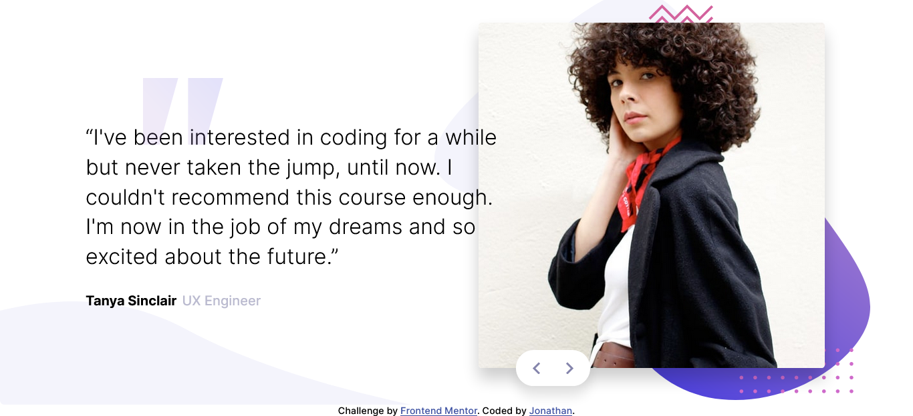
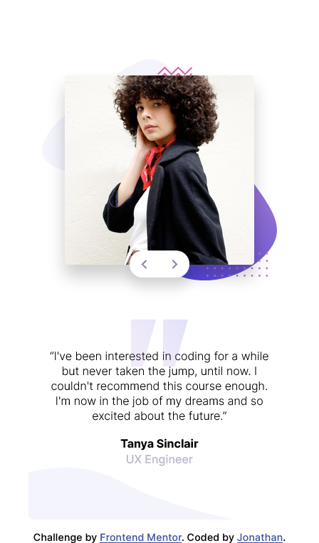

# Frontend Mentor - Coding bootcamp testimonials slider solution

This is a solution to the [Coding bootcamp testimonials slider challenge on Frontend Mentor](https://www.frontendmentor.io/challenges/coding-bootcamp-testimonials-slider-4FNyLA8JL). Frontend Mentor challenges help you improve your coding skills by building realistic projects.

## Table of contents

- [Overview](#overview)
  - [The challenge](#the-challenge)
  - [Screenshot](#screenshot)
  - [Links](#links)
- [My process](#my-process)
  - [Built with](#built-with)
  - [What I learned](#what-i-learned)
  - [Continued development](#continued-development)
  - [Useful resources](#useful-resources)
- [Author](#author)
- [Acknowledgments](#acknowledgments)

**Note: Delete this note and update the table of contents based on what sections you keep.**

## Overview

### The challenge

Users should be able to:

- View the optimal layout for the component depending on their device's screen size
- Navigate the slider using either their mouse/trackpad or keyboard

### Screenshot

### Links

- Solution URL: [Add solution URL here](https://your-solution-url.com)
- Live Site URL: [Add live site URL here](https://your-live-site-url.com)

## My process

### Built with

- Semantic HTML5 markup
- Flexbox
- Mobile-first workflow

### What I learned

- I mostly learnt how to overlap items using CSS Flexbox
- I also learnt about using the `aria-live` attribute along with the `aria-controls` in html in order to help screen readers announed the updates when the testimonial card is updated

### Useful resources

- [The Aria live region](https://developer.mozilla.org/en-US/docs/Web/Accessibility/ARIA/ARIA_Live_Regions) - This MDN article helped me understand better how the `aria-live` attribute works.

## Author

- Github - [Jonathan](https://github.com/jonathan401)
- Frontend Mentor - [@jonathan401](https://www.frontendmentor.io/profile/jonathan401)
- Twitter - [@yourusername](https://www.twitter.com/yourusername)

## Acknowledgments

I'd love to give a hat tip to [@ecemgo](https://www.frontendmentor.io/profile/ecemgo). Her solution inspired me to be able to properly scale the font sizes of my solution. Her live site helped a lot 😊. You can checkout her solution [here](https://github.com/ecemgo/frontend-mentor-challenges/tree/main/coding-bootcamp-testimonials-slider)
